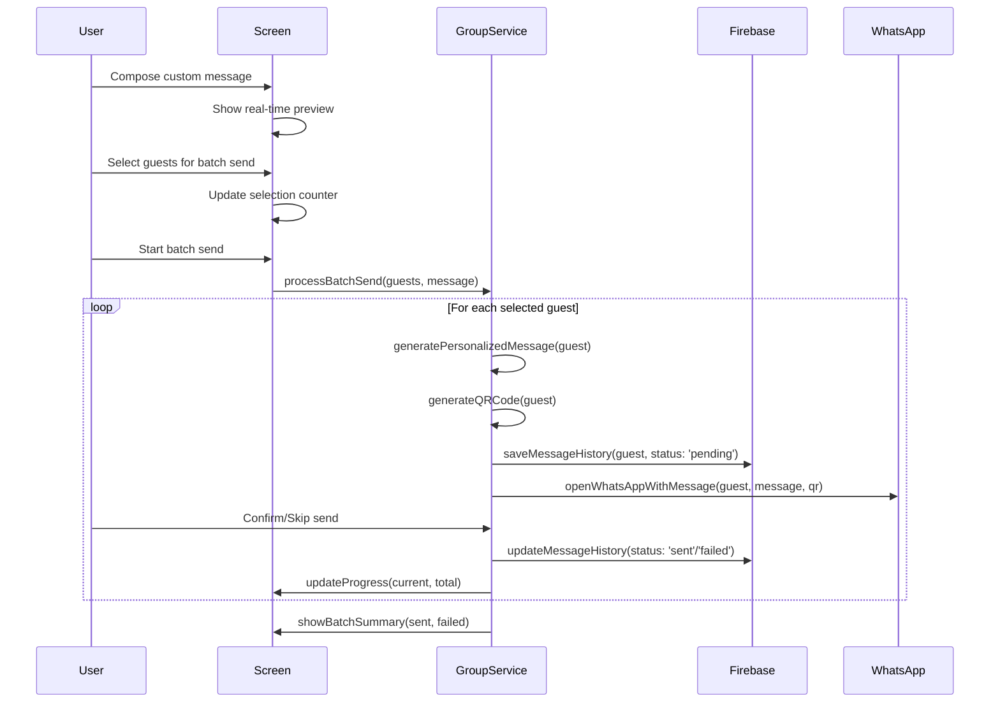

# Design Document - WhatsApp Group Messaging with Customization

## Overview

Cette fonctionnalité étend le système existant de partage QR codes en ajoutant la capacité d'envoyer des messages WhatsApp groupés avec des messages personnalisables. La solution s'intègre parfaitement dans l'architecture Firebase existante et réutilise les services déjà en place pour la synchronisation temps réel et la gestion des invités.

## Architecture

### High-Level Architecture

```
┌─────────────────────────────────────────────────────────────┐
│                WhatsAppGroupMessagingScreen                  │
│  ┌───────────────────────────────────────────────────────┐  │
│  │              Message Composer Component                │  │
│  │    (Template Editor, Preview, Variables)              │  │
│  └───────────────────────────────────────────────────────┘  │
│  ┌───────────────────────────────────────────────────────┐  │
│  │              Guest Selection Component                 │  │
│  │    (Tabs, Checkboxes, Filters, Status Icons)         │  │
│  └───────────────────────────────────────────────────────┘  │
│  ┌───────────────────────────────────────────────────────┐  │
│  │              Batch Progress Component                  │  │
│  │         (Progress Bar, Send Controls)                 │  │
│  └───────────────────────────────────────────────────────┘  │
└─────────────────────────────────────────────────────────────┘
                            │
                            ▼
        ┌───────────────────────────────────────┐
        │    WhatsApp Group Messaging Service    │
        │  (whatsappGroupService.ts)            │
        └───────────────────────────────────────┘
                            │
        ┌───────────────────┴───────────────────┐
        ▼                   ▼                   ▼
┌──────────────┐   ┌──────────────┐   ┌──────────────┐
│ Firebase     │   │ Message      │   │ QR Code      │
│ Service      │   │ Template     │   │ Generation   │
│ (Existing)   │   │ System       │   │ (Existing)   │
└──────────────┘   └──────────────┘   └──────────────┘
        │                   │                   │
        ▼                   ▼                   ▼
┌──────────────┐   ┌──────────────┐   ┌──────────────┐
│ Firestore    │   │ AsyncStorage │   │ ViewShot     │
│ Collections  │   │ Templates    │   │ Capture      │
└──────────────┘   └──────────────┘   └──────────────┘
```

### Firebase Collections Structure

```
firestore/
├── guests/                    # Collection existante étendue
│   └── {guestId}/
│       ├── fullName: string
│       ├── tableName: string
│       ├── companions: number
│       ├── isPresent: boolean
│       ├── phoneNumber: string    # NOUVEAU CHAMP
│       ├── createdAt: timestamp
│       ├── updatedAt: timestamp
│       └── updatedBy: string
│
├── message_history/           # NOUVELLE COLLECTION
│   └── {messageId}/
│       ├── guestId: string
│       ├── organizerId: string
│       ├── messageContent: string
│       ├── qrCodeUri: string
│       ├── status: 'sent' | 'failed' | 'pending'
│       ├── sentAt: timestamp
│       ├── errorMessage?: string
│       └── retryCount: number
│
├── message_templates/         # NOUVELLE COLLECTION
│   └── {templateId}/
│       ├── name: string
│       ├── content: string
│       ├── isDefault: boolean
│       ├── createdBy: string
│       ├── createdAt: timestamp
│       └── usageCount: number
│
└── settings/                  # Collection existante étendue
    └── default_message_template/
        ├── content: string
        ├── updatedAt: timestamp
        └── updatedBy: string
```

### Component Flow



## Components and Interfaces

### 1. WhatsAppGroupMessagingScreen Component

**Responsabilité**: Écran principal pour la composition et l'envoi groupé de messages WhatsApp.

**Props**: Aucune (utilise React Navigation)

**State**:
```typescript
interface ScreenState {
  guests: Guest[];
  selectedGuestIds: Set<string>;
  messageTemplate: string;
  previewGuest: Guest | null;
  currentTab: 'all' | 'with_phone' | 'without_phone';
  isLoading: boolean;
  batchProgress: BatchProgress | null;
  messageTemplates: MessageTemplate[];
}

interface BatchProgress {
  current: number;
  total: number;
  sent: number;
  failed: number;
  currentGuest: Guest | null;
}
```

### 2. MessageComposer Component

**Responsabilité**: Interface de composition et prévisualisation des messages.

**Props**:
```typescript
interface MessageComposerProps {
  template: string;
  onTemplateChange: (template: string) => void;
  previewGuest: Guest | null;
  onPreviewGuestChange: (guest: Guest) => void;
  guests: Guest[];
  templates: MessageTemplate[];
  onLoadTemplate: (template: MessageTemplate) => void;
  onSaveTemplate: (name: string) => void;
}
```

**Features**:
- Zone de texte multiligne avec syntaxe highlighting pour les variables
- Aperçu en temps réel avec substitution des variables
- Sélecteur d'invité pour tester l'aperçu
- Compteur de caractères avec avertissement (>1000)
- Boutons de gestion des templates (sauvegarder, charger, réinitialiser)

### 3. GuestSelection Component

**Responsabilité**: Sélection des invités avec filtres et statuts d'envoi.

**Props**:
```typescript
interface GuestSelectionProps {
  guests: Guest[];
  selectedIds: Set<string>;
  onSelectionChange: (selectedIds: Set<string>) => void;
  currentTab: TabType;
  onTabChange: (tab: TabType) => void;
  messageHistory: MessageHistory[];
}

type TabType = 'all' | 'with_phone' | 'without_phone';
```

**Features**:
- Onglets avec badges de comptage
- Cases à cocher avec sélection multiple
- Bouton "Tout sélectionner/désélectionner"
- Indicateurs de statut d'envoi (✅ ❌ ⏳)
- Ajout rapide de numéro de téléphone inline

### 4. WhatsApp Group Messaging Service

**Fichier**: `src/services/whatsappGroupService.ts`

**Interface**:
```typescript
interface WhatsAppGroupService {
  // Gestion des templates
  getDefaultTemplate(): Promise<string>;
  saveCustomTemplate(name: string, content: string): Promise<void>;
  getCustomTemplates(): Promise<MessageTemplate[]>;
  deleteCustomTemplate(templateId: string): Promise<void>;
  
  // Personnalisation des messages
  personalizeMessage(template: string, guest: Guest): string;
  validateMessageTemplate(template: string): ValidationResult;
  
  // Envoi groupé
  processBatchSend(
    guests: Guest[], 
    template: string, 
    onProgress: (progress: BatchProgress) => void
  ): Promise<BatchResult>;
  
  // Historique
  getMessageHistory(guestId?: string): Promise<MessageHistory[]>;
  retryFailedMessages(guestIds: string[]): Promise<BatchResult>;
  
  // Validation
  validatePhoneNumber(phoneNumber: string): boolean;
  formatPhoneNumber(phoneNumber: string): string;
}
```

### 5. Message Template System

**Responsabilité**: Gestion des templates de messages avec variables.

**Variables supportées**:
- `${nom-de-l-invite}` → guest.fullName
- `${table}` → guest.tableName  
- `${accompagnants}` → guest.companions
- `${date-evenement}` → configurable dans les paramètres
- `${lieu-evenement}` → configurable dans les paramètres

**Template par défaut**:
```
${nom-de-l-invite}, ce QR code tient lieu d'invitation pour le mariage.

📍 Table : ${table}
👥 Accompagnants : ${accompagnants}

Veuillez présenter cela à l'entrée de la salle le jour J.

Merci et à très bientôt ! 💒✨
```

## Data Models

### Extended Guest Interface

```typescript
interface Guest {
  id: string;
  fullName: string;
  tableName: string;
  companions: number;
  isPresent: boolean;
  phoneNumber?: string;        // NOUVEAU CHAMP
  createdAt: Timestamp;
  updatedAt: Timestamp;
  updatedBy: string;
}
```

### Message History

```typescript
interface MessageHistory {
  id: string;
  guestId: string;
  organizerId: string;
  messageContent: string;
  qrCodeUri: string;
  status: 'sent' | 'failed' | 'pending';
  sentAt: Timestamp;
  errorMessage?: string;
  retryCount: number;
}
```

### Message Template

```typescript
interface MessageTemplate {
  id: string;
  name: string;
  content: string;
  isDefault: boolean;
  createdBy: string;
  createdAt: Timestamp;
  usageCount: number;
}
```

### Batch Result

```typescript
interface BatchResult {
  total: number;
  sent: number;
  failed: number;
  failedGuests: Array<{
    guest: Guest;
    error: string;
  }>;
}
```

## Correctness Properties

*A property is a characteristic or behavior that should hold true across all valid executions of a system-essentially, a formal statement about what the system should do. Properties serve as the bridge between human-readable specifications and machine-verifiable correctness guarantees.*

### Property Reflection

After analyzing all acceptance criteria, I identified several areas where properties could be consolidated:

**Redundancy eliminated:**
- Template content validation properties (3.1-3.4) can be combined into a single comprehensive template validation property
- Message history properties (10.2-10.5) can be consolidated into fewer, more comprehensive properties  
- UI state management properties (4.4, 4.5, 5.5) can be combined into a single state consistency property
- Firebase synchronization properties (11.1-11.5) can be consolidated into fewer properties covering sync behavior

**Properties consolidated:**
- Template system properties (8.1-8.5) combined into comprehensive template management properties
- Guest filtering properties (9.2-9.5) combined into filtering consistency properties
- Message personalization properties (5.1, 5.2) combined into a single personalization property

### Core Properties

**Property 1: Phone number validation consistency**
*For any* phone number input, the validation should accept valid international formats (+33, +1, etc.) and reject invalid formats, while allowing empty/null values
**Validates: Requirements 1.2, 1.3, 1.4**

**Property 2: CSV import phone number handling**
*For any* CSV file with optional phoneNumber column, the import should correctly process guests with and without phone numbers
**Validates: Requirements 1.5**

**Property 3: Message personalization accuracy**
*For any* message template and guest data, variable substitution should replace all template variables with the correct guest-specific values
**Validates: Requirements 2.4, 5.1, 5.2**

**Property 4: Guest filtering consistency**
*For any* guest list, filtering by phone number status should show only guests matching the filter criteria, with correct counts in badges
**Validates: Requirements 4.2, 9.2, 9.4**

**Property 5: Selection state management**
*For any* guest selection changes, the UI should maintain consistent state across tab switches and update counters accurately
**Validates: Requirements 4.3, 4.4, 4.5, 9.3**

**Property 6: Template management integrity**
*For any* template operations (save, load, delete), the system should maintain template data integrity and enforce the 10-template limit
**Validates: Requirements 8.1, 8.2, 8.3, 8.4, 8.5**

**Property 7: Message length validation**
*For any* message content, the system should correctly calculate length and warn when exceeding 1000 characters
**Validates: Requirements 6.3**

**Property 8: Batch processing progress tracking**
*For any* batch send operation, the progress counter should accurately reflect current position and maintain correct sent/failed counts
**Validates: Requirements 5.5, 7.1, 7.2**

**Property 9: Message history persistence**
*For any* message send attempt, the system should create a history record with correct guest ID, organizer ID, status, and timestamp
**Validates: Requirements 10.2, 12.2**

**Property 10: Duplicate message prevention**
*For any* guest and date combination, the system should prevent sending multiple messages to the same guest on the same day
**Validates: Requirements 12.4**

**Property 11: Firebase synchronization consistency**
*For any* phone number modification, the change should be persisted to Firestore and reflected in real-time across all connected clients
**Validates: Requirements 11.1, 11.2, 11.3**

**Property 12: Offline synchronization reliability**
*For any* changes made while offline, the system should queue them and sync automatically when connection is restored
**Validates: Requirements 11.5**

**Property 13: Retry mechanism accuracy**
*For any* failed message sends, the retry function should only attempt to resend messages marked as failed
**Validates: Requirements 7.3**

**Property 14: Error logging completeness**
*For any* error during batch processing, the system should log the error with sufficient detail for debugging
**Validates: Requirements 7.4**

**Property 15: WhatsApp fallback behavior**
*For any* device without WhatsApp installed, the system should detect this and offer native sharing alternatives
**Validates: Requirements 7.5**

## Error Handling

### Error Types

```typescript
enum WhatsAppGroupError {
  INVALID_PHONE_NUMBER = 'INVALID_PHONE_NUMBER',
  TEMPLATE_VALIDATION_FAILED = 'TEMPLATE_VALIDATION_FAILED',
  FIREBASE_SYNC_FAILED = 'FIREBASE_SYNC_FAILED',
  BATCH_SEND_FAILED = 'BATCH_SEND_FAILED',
  TEMPLATE_LIMIT_EXCEEDED = 'TEMPLATE_LIMIT_EXCEEDED',
  MESSAGE_TOO_LONG = 'MESSAGE_TOO_LONG',
  NO_GUESTS_SELECTED = 'NO_GUESTS_SELECTED',
  WHATSAPP_NOT_AVAILABLE = 'WHATSAPP_NOT_AVAILABLE',
  QR_GENERATION_FAILED = 'QR_GENERATION_FAILED',
  OFFLINE_MODE = 'OFFLINE_MODE'
}
```

### Error Handling Strategy

1. **Phone Number Validation Errors**:
   - Afficher un message d'aide avec format attendu (+33123456789)
   - Permettre de continuer sans numéro (champ optionnel)
   - Suggérer des corrections automatiques pour formats courants

2. **Firebase Synchronization Errors**:
   - Mode hors ligne automatique avec queue de synchronisation
   - Retry automatique avec backoff exponentiel
   - Notification utilisateur des problèmes de connexion

3. **Batch Send Errors**:
   - Continuer le traitement malgré les échecs individuels
   - Marquer les échecs pour retry ultérieur
   - Résumé détaillé avec possibilité de relancer les échecs

4. **Template Errors**:
   - Validation en temps réel avec messages d'aide
   - Sauvegarde automatique des brouillons
   - Restauration du template par défaut en cas de corruption

### Error Messages (Français)

```typescript
const ERROR_MESSAGES = {
  INVALID_PHONE_NUMBER: 'Format de numéro invalide. Utilisez le format international (+33123456789)',
  TEMPLATE_VALIDATION_FAILED: 'Le template contient des erreurs. Vérifiez la syntaxe des variables.',
  FIREBASE_SYNC_FAILED: 'Problème de synchronisation. Vos modifications seront sauvées hors ligne.',
  BATCH_SEND_FAILED: 'Erreur lors de l\'envoi groupé. Consultez le résumé pour les détails.',
  TEMPLATE_LIMIT_EXCEEDED: 'Limite de 10 templates atteinte. Supprimez un template existant.',
  MESSAGE_TOO_LONG: 'Message trop long (>1000 caractères). Raccourcissez le contenu.',
  NO_GUESTS_SELECTED: 'Aucun invité sélectionné. Cochez au moins un invité pour continuer.',
  WHATSAPP_NOT_AVAILABLE: 'WhatsApp non installé. Utilisation du partage système.',
  QR_GENERATION_FAILED: 'Impossible de générer le QR code. Vérifiez les données de l\'invité.',
  OFFLINE_MODE: 'Mode hors ligne activé. Les modifications seront synchronisées à la reconnexion.'
};
```

## Testing Strategy

### Unit Tests

1. **Phone Number Validation Tests**:
   - Test des formats internationaux valides (+33, +1, +44, etc.)
   - Test des formats invalides (lettres, trop court, trop long)
   - Test des valeurs vides/null (doivent être acceptées)

2. **Message Template Tests**:
   - Test de substitution des variables
   - Test de validation des templates
   - Test de gestion des templates personnalisés
   - Test des limites de longueur

3. **Firebase Integration Tests**:
   - Test de synchronisation des numéros de téléphone
   - Test de l'historique des messages
   - Test du mode hors ligne
   - Mock des APIs Firebase

### Property-Based Tests

La stratégie de test utilise **fast-check** pour JavaScript/TypeScript avec un minimum de 100 itérations par propriété.

1. **Phone Number Property Tests**:
   - Générer des numéros de téléphone aléatoires valides et invalides
   - Vérifier que la validation est cohérente
   - Tester la formatage automatique

2. **Message Personalization Property Tests**:
   - Générer des templates avec variables aléatoires
   - Générer des données d'invités aléatoires
   - Vérifier que toutes les variables sont correctement substituées

3. **Batch Processing Property Tests**:
   - Générer des listes d'invités de tailles variables
   - Simuler des échecs aléatoires
   - Vérifier que les compteurs et statuts sont corrects

4. **Template Management Property Tests**:
   - Générer des opérations de template aléatoires (save, load, delete)
   - Vérifier l'intégrité des données
   - Tester la limite de 10 templates

### Integration Tests

1. **End-to-End Workflow Tests**:
   - Test du flux complet : composition → sélection → envoi
   - Test de l'intégration Firebase temps réel
   - Test de la gestion des erreurs bout en bout

2. **Cross-Platform Tests**:
   - Test sur Android et iOS
   - Test avec et sans WhatsApp installé
   - Test des permissions et partage natif

### Manual Testing Checklist

- [ ] Ajouter des numéros de téléphone à différents invités
- [ ] Composer un message personnalisé avec toutes les variables
- [ ] Tester l'aperçu avec différents invités
- [ ] Sélectionner des invités avec les différents filtres
- [ ] Lancer un envoi groupé et tester les confirmations
- [ ] Tester le retry des messages échoués
- [ ] Vérifier la synchronisation temps réel entre appareils
- [ ] Tester le mode hors ligne et la resynchronisation
- [ ] Sauvegarder et charger des templates personnalisés
- [ ] Vérifier l'historique des messages
- [ ] Tester sur appareil sans WhatsApp
- [ ] Vérifier les performances avec 100+ invités

## Performance Considerations

### Firebase Optimization

- Utiliser des listeners Firestore avec `limit()` pour les grandes listes
- Implémenter la pagination pour l'historique des messages
- Utiliser des index composites pour les requêtes complexes
- Cache local avec `enablePersistence()` pour le mode hors ligne

### Memory Management

- Nettoyer les listeners Firestore lors du démontage des composants
- Utiliser `React.memo` pour les composants de liste d'invités
- Implémenter la virtualisation pour les très grandes listes
- Gérer la mémoire des images QR générées

### UI Responsiveness

- Utiliser `InteractionManager.runAfterInteractions()` pour les opérations lourdes
- Implémenter le debouncing pour la recherche et les filtres
- Utiliser des animations fluides pour les transitions d'état
- Afficher des loaders appropriés pendant les opérations asynchrones

### Batch Processing Optimization

- Traiter les envois par petits lots (5-10 à la fois)
- Implémenter des pauses entre les envois pour éviter le spam
- Utiliser des workers ou des tâches en arrière-plan si disponible
- Optimiser la génération des QR codes (cache, réutilisation)

## Security Considerations

### Data Privacy

- Les numéros de téléphone sont stockés chiffrés dans Firestore
- Pas de stockage local permanent des numéros sensibles
- Logs d'audit pour tracer les accès aux données personnelles
- Respect du RGPD avec possibilité de suppression des données

### Firebase Security Rules

```javascript
rules_version = '2';
service cloud.firestore {
  match /databases/{database}/documents {
    // Règles pour les invités (incluant phoneNumber)
    match /guests/{guestId} {
      allow read, write: if request.auth != null;
      allow update: if request.auth != null && 
        validatePhoneNumber(request.resource.data.phoneNumber);
    }
    
    // Règles pour l'historique des messages
    match /message_history/{messageId} {
      allow read: if request.auth != null;
      allow create: if request.auth != null && 
        request.auth.uid == request.resource.data.organizerId;
      allow update: if request.auth != null && 
        request.auth.uid == resource.data.organizerId;
    }
    
    // Règles pour les templates
    match /message_templates/{templateId} {
      allow read: if request.auth != null;
      allow write: if request.auth != null && 
        request.auth.uid == request.resource.data.createdBy;
    }
    
    // Fonction de validation des numéros de téléphone
    function validatePhoneNumber(phoneNumber) {
      return phoneNumber == null || 
        (phoneNumber is string && phoneNumber.matches('^\\+[1-9]\\d{1,14}$'));
    }
  }
}
```

### Message Content Security

- Validation et sanitisation des templates personnalisés
- Limitation de la longueur des messages (1000 caractères)
- Filtrage des caractères spéciaux potentiellement dangereux
- Pas d'exécution de code dans les templates (variables simples uniquement)

## UI/UX Design

### Layout Structure

```
┌─────────────────────────────────────┐
│  Header: "Envoi Groupé WhatsApp"    │
├─────────────────────────────────────┤
│  📝 Composer votre message          │
│  ┌─────────────────────────────┐   │
│  │ [Template avec variables]   │   │
│  │ ${nom-de-l-invite}, ce QR   │   │
│  │ code tient lieu...          │   │
│  │                             │   │
│  └─────────────────────────────┘   │
│  [Réinitialiser] [Sauvegarder]     │
│                                     │
│  👁️ Aperçu (Jean Dupont)           │
│  ┌─────────────────────────────┐   │
│  │ Jean Dupont, ce QR code...  │   │
│  │ Table: Table 5              │   │
│  │ [QR CODE PREVIEW]           │   │
│  └─────────────────────────────┘   │
│                                     │
│  👥 Sélectionner les invités        │
│  [Tous(15)] [Avec tél(12)] [Sans(3)]│
│  ☑️ Tout sélectionner (12 sélectionnés)│
│  ┌─────────────────────────────┐   │
│  │ ☑️ Jean Dupont ✅ +33123... │   │
│  │ ☑️ Marie Martin ❌ +33456...│   │
│  │ ☐ Paul Durand ⏳ +33789... │   │
│  └─────────────────────────────┘   │
│                                     │
│  📤 [Envoyer à 12 invités]         │
└─────────────────────────────────────┘
```

### Color Scheme & Icons

- **Variables dans template**: `#007AFF` (bleu iOS)
- **Statut envoyé**: `#34C759` (vert) avec ✅
- **Statut échoué**: `#FF3B30` (rouge) avec ❌  
- **Statut en attente**: `#FF9500` (orange) avec ⏳
- **Bouton principal**: `#25D366` (vert WhatsApp)
- **Onglets actifs**: `#007AFF` avec badges blancs

### Responsive Design

- Adaptation automatique pour tablettes (colonnes multiples)
- Gestion des claviers virtuels (scroll automatique)
- Support des modes portrait/paysage
- Accessibilité complète (VoiceOver, TalkBack)

## Integration Points

### Existing Firebase Service

- Étendre `firebaseService.ts` avec les méthodes de gestion des numéros
- Réutiliser les listeners existants pour la synchronisation temps réel
- Utiliser les mêmes patterns d'authentification et de validation
- Intégrer dans le système d'audit existant

### Existing QR Code System

- Réutiliser `qrUtils.ts` pour la génération des QR codes
- Utiliser le même format de données QR existant
- Intégrer avec le système de capture ViewShot existant
- Maintenir la compatibilité avec le scanner existant

### Navigation Integration

- Ajouter l'écran dans `AppNavigator.tsx`
- Permettre l'accès depuis `HomeScreen` et `GuestListScreen`
- Passer des paramètres pour pré-sélectionner des invités
- Intégrer dans le flux de navigation existant

## Dependencies

### Packages Requis (déjà installés)

- `@react-native-async-storage/async-storage`: Stockage des templates
- `react-native-view-shot`: Capture des QR codes
- `expo-sharing`: Partage WhatsApp
- `react-native-qrcode-svg`: Génération QR
- `firebase`: Services Firebase existants

### Nouvelles dépendances

- `react-native-phone-number-input`: ^2.1.0 - Saisie formatée des numéros
- `libphonenumber-js`: ^1.10.0 - Validation des numéros internationaux

### Configuration Firebase

Mise à jour des règles de sécurité Firestore pour supporter les nouvelles collections et le champ phoneNumber dans la collection guests existante.