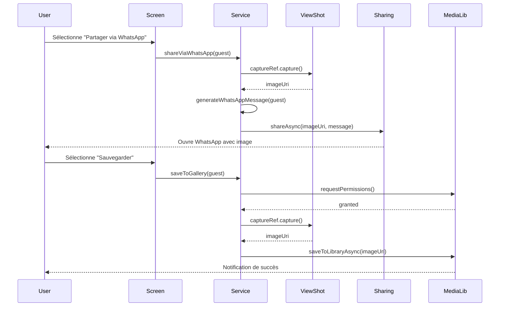

# Design Document - WhatsApp QR Code Sharing

## Overview

Cette fonctionnalité améliore le système existant de partage de QR codes en permettant la capture et le partage d'images QR code via WhatsApp. La solution s'intègre dans l'architecture React Native existante et utilise les packages Expo déjà installés pour la capture d'écran, le partage et l'accès à la galerie.

## Architecture

### High-Level Architecture

```
┌─────────────────────────────────────────────────────────────┐
│                    QRWhatsAppShareScreen                     │
│  ┌───────────────────────────────────────────────────────┐  │
│  │              Guest Navigation Component                │  │
│  │         (Previous/Next, Counter Display)              │  │
│  └───────────────────────────────────────────────────────┘  │
│  ┌───────────────────────────────────────────────────────┐  │
│  │              Guest Info Display                        │  │
│  │         (Name, Table, Companions)                     │  │
│  └───────────────────────────────────────────────────────┘  │
│  ┌───────────────────────────────────────────────────────┐  │
│  │              QR Code View (Capturable)                │  │
│  │         Wrapped in ViewShot Component                 │  │
│  └───────────────────────────────────────────────────────┘  │
│  ┌───────────────────────────────────────────────────────┐  │
│  │              Action Buttons                            │  │
│  │    [Share WhatsApp] [Save to Gallery] [Share Other]   │  │
│  └───────────────────────────────────────────────────────┘  │
└─────────────────────────────────────────────────────────────┘
                            │
                            ▼
        ┌───────────────────────────────────────┐
        │      QR Sharing Service Module         │
        │  (qrSharingService.ts)                │
        └───────────────────────────────────────┘
                            │
        ┌───────────────────┴───────────────────┐
        ▼                   ▼                   ▼
┌──────────────┐   ┌──────────────┐   ┌──────────────┐
│ Image        │   │ WhatsApp     │   │ Media        │
│ Capture      │   │ Share        │   │ Library      │
│ (ViewShot)   │   │ (Sharing)    │   │ (MediaLib)   │
└──────────────┘   └──────────────┘   └──────────────┘
```

### Component Flow



## Components and Interfaces

### 1. QRWhatsAppShareScreen Component

**Responsabilité**: Écran principal pour la capture et le partage de QR codes via WhatsApp.

**Props**: Aucune (utilise React Navigation)

**State**:
```typescript
interface ScreenState {
  guests: Guest[];
  currentIndex: number;
  loading: boolean;
  captureRef: RefObject<ViewShot>;
}
```

**Hooks utilisés**:
- `useState` pour la gestion de l'état local
- `useEffect` pour le chargement initial des invités
- `useRef` pour la référence au composant ViewShot

### 2. QR Sharing Service Module

**Fichier**: `src/services/qrSharingService.ts`

**Interface**:
```typescript
interface QRSharingService {
  // Capture le QR code comme image
  captureQRCode(viewShotRef: RefObject<ViewShot>): Promise<string>;
  
  // Partage via WhatsApp
  shareViaWhatsApp(imageUri: string, guest: Guest): Promise<void>;
  
  // Sauvegarde dans la galerie
  saveToGallery(imageUri: string, guest: Guest): Promise<void>;
  
  // Partage via le menu natif
  shareViaSystem(imageUri: string, guest: Guest): Promise<void>;
  
  // Génère le message WhatsApp
  generateShareMessage(guest: Guest): string;
}
```

**Fonctions principales**:

```typescript
// Capture le QR code
export const captureQRCode = async (
  viewShotRef: RefObject<ViewShot>
): Promise<string> => {
  if (!viewShotRef.current) {
    throw new Error('ViewShot reference not available');
  }
  
  const uri = await viewShotRef.current.capture();
  return uri;
};

// Partage via WhatsApp
export const shareViaWhatsApp = async (
  imageUri: string,
  guest: Guest
): Promise<void> => {
  const message = generateShareMessage(guest);
  
  await Sharing.shareAsync(imageUri, {
    mimeType: 'image/png',
    dialogTitle: `Invitation - ${guest.fullName}`,
    UTI: 'public.png'
  });
};

// Sauvegarde dans la galerie
export const saveToGallery = async (
  imageUri: string,
  guest: Guest
): Promise<void> => {
  const { status } = await MediaLibrary.requestPermissionsAsync();
  
  if (status !== 'granted') {
    throw new Error('Permission denied');
  }
  
  const asset = await MediaLibrary.createAssetAsync(imageUri);
  await MediaLibrary.createAlbumAsync('Wedding QR Codes', asset, false);
};
```

### 3. Enhanced QR Utils

**Ajouts à** `src/utils/qrUtils.ts`:

```typescript
// Message de partage optimisé pour WhatsApp
export const generateWhatsAppShareMessage = (guest: GuestQRData): string => {
  return `🎉 *Invitation de mariage*

Bonjour ${guest.fullName} !

Voici votre QR code d'invitation personnalisé 📱

*Détails de votre invitation :*
📍 Table : ${guest.tableName}
👥 Accompagnants : ${guest.companions}
🆔 ID : #${guest.id}

*Instructions :*
1️⃣ Sauvegardez cette image sur votre téléphone
2️⃣ Présentez-la à l'entrée le jour J
3️⃣ Notre équipe la scannera pour confirmer votre présence

Merci et à très bientôt ! 💒✨`;
};
```

## Data Models

### Guest Interface (existant)

```typescript
interface Guest {
  id: number;
  fullName: string;
  tableName: string;
  companions: number;
  isPresent: number;
}
```

### QR Capture Result

```typescript
interface QRCaptureResult {
  success: boolean;
  uri?: string;
  error?: string;
}
```

### Share Result

```typescript
interface ShareResult {
  success: boolean;
  action?: 'shared' | 'dismissed';
  error?: string;
}
```

## Error Handling

### Error Types

```typescript
enum QRSharingError {
  CAPTURE_FAILED = 'CAPTURE_FAILED',
  PERMISSION_DENIED = 'PERMISSION_DENIED',
  SHARE_FAILED = 'SHARE_FAILED',
  SAVE_FAILED = 'SAVE_FAILED',
  NO_GUESTS = 'NO_GUESTS',
  WHATSAPP_NOT_AVAILABLE = 'WHATSAPP_NOT_AVAILABLE'
}
```

### Error Handling Strategy

1. **Capture Errors**: 
   - Afficher un message d'erreur avec option de réessayer
   - Logger l'erreur pour le debugging
   - Proposer une alternative (partage de données textuelles)

2. **Permission Errors**:
   - Expliquer pourquoi la permission est nécessaire
   - Guider l'utilisateur vers les paramètres si refusé
   - Proposer une alternative (partage sans sauvegarde)

3. **Share Errors**:
   - Détecter si WhatsApp est installé
   - Fallback vers le menu de partage natif
   - Afficher un message clair sur l'action à effectuer

4. **Network/System Errors**:
   - Retry automatique (1 fois)
   - Message d'erreur utilisateur-friendly
   - Option de contact support si persistant

### Error Messages (Français)

```typescript
const ERROR_MESSAGES = {
  CAPTURE_FAILED: 'Impossible de capturer le QR code. Veuillez réessayer.',
  PERMISSION_DENIED: 'Permission refusée. Activez l\'accès à la galerie dans les paramètres.',
  SHARE_FAILED: 'Impossible de partager. Vérifiez que WhatsApp est installé.',
  SAVE_FAILED: 'Impossible de sauvegarder l\'image. Vérifiez l\'espace disponible.',
  NO_GUESTS: 'Aucun invité trouvé. Ajoutez des invités d\'abord.',
  WHATSAPP_NOT_AVAILABLE: 'WhatsApp n\'est pas installé. Utilisez le partage standard.'
};
```

## Testing Strategy

### Unit Tests

1. **QR Sharing Service Tests**:
   - Test de génération de message WhatsApp
   - Test de validation des permissions
   - Test de gestion des erreurs
   - Mock des APIs Expo (ViewShot, Sharing, MediaLibrary)

2. **QR Utils Tests**:
   - Test de génération de données QR
   - Test de parsing de données QR
   - Test de formatage des messages

### Integration Tests

1. **Screen Integration Tests**:
   - Test du flux complet de partage
   - Test de navigation entre invités
   - Test de gestion des états (loading, error, success)
   - Test des interactions utilisateur

2. **Permission Flow Tests**:
   - Test de demande de permissions
   - Test de gestion des refus
   - Test de fallback scenarios

### Manual Testing Checklist

- [ ] Générer un QR code pour un invité
- [ ] Capturer le QR code comme image
- [ ] Partager via WhatsApp (avec WhatsApp installé)
- [ ] Partager via menu natif (sans WhatsApp)
- [ ] Sauvegarder dans la galerie
- [ ] Vérifier les permissions (accordées/refusées)
- [ ] Naviguer entre plusieurs invités
- [ ] Tester avec 0 invités
- [ ] Tester avec 1 invité
- [ ] Tester avec 100+ invités
- [ ] Vérifier la qualité de l'image générée
- [ ] Scanner le QR code généré pour validation
- [ ] Tester sur Android
- [ ] Tester sur iOS

## Performance Considerations

### Image Capture Optimization

- Utiliser `captureMode: 'mount'` pour ViewShot pour de meilleures performances
- Définir une qualité d'image optimale (0.9) pour équilibrer taille et qualité
- Utiliser le format PNG pour préserver la qualité du QR code

### Memory Management

- Nettoyer les URIs d'images temporaires après partage
- Limiter le nombre d'images en cache
- Utiliser `FileSystem.deleteAsync()` pour les fichiers temporaires

### UI Responsiveness

- Afficher un loader pendant la capture d'image
- Désactiver les boutons pendant les opérations asynchrones
- Utiliser des animations fluides pour les transitions

## Security Considerations

### Data Privacy

- Les QR codes contiennent uniquement les données nécessaires (ID, nom, table, accompagnants)
- Pas de données sensibles (téléphone, email, adresse)
- Timestamp pour traçabilité mais pas d'informations personnelles supplémentaires

### Permission Handling

- Demander les permissions uniquement quand nécessaire (just-in-time)
- Expliquer clairement pourquoi chaque permission est requise
- Respecter les refus de permission et proposer des alternatives

### Image Storage

- Les images sauvegardées sont stockées dans l'album photos de l'utilisateur
- Pas de stockage cloud automatique
- L'utilisateur garde le contrôle total sur ses images

## UI/UX Design

### Layout Structure

```
┌─────────────────────────────────────┐
│  Header: "Partage QR Code"          │
│  Counter: "3 / 15"                  │
├─────────────────────────────────────┤
│                                     │
│  ┌─────────────────────────────┐   │
│  │  Nom: Jean Dupont           │   │
│  │  📍 Table: Table 5          │   │
│  │  👥 Accompagnants: 2        │   │
│  └─────────────────────────────┘   │
│                                     │
│  ┌─────────────────────────────┐   │
│  │                             │   │
│  │      [QR CODE IMAGE]        │   │
│  │         250x250             │   │
│  │                             │   │
│  └─────────────────────────────┘   │
│                                     │
│  ┌─────────────────────────────┐   │
│  │ 📱 Partager via WhatsApp    │   │
│  └─────────────────────────────┘   │
│  ┌─────────────────────────────┐   │
│  │ 💾 Sauvegarder dans galerie │   │
│  └─────────────────────────────┘   │
│  ┌─────────────────────────────┐   │
│  │ 📤 Partager autrement       │   │
│  └─────────────────────────────┘   │
│                                     │
├─────────────────────────────────────┤
│  [← Précédent]    [Suivant →]      │
└─────────────────────────────────────┘
```

### Color Scheme

- Utiliser le thème existant de l'application
- QR code: fond blanc (#FFFFFF) avec code noir (#000000) pour maximum contraste
- Boutons: couleurs primaires pour actions principales
- États désactivés: opacité réduite (0.5)

### Feedback Visuel

- Loader pendant la capture d'image
- Animation de succès après sauvegarde
- Toast notifications pour les confirmations
- Indicateurs de progression pour les opérations longues

## Integration Points

### Existing Components

- Réutiliser `Button` component existant
- Réutiliser `Card` component existant
- Utiliser le `theme` existant pour la cohérence visuelle

### Database Integration

- Utiliser `getAllGuests()` existant pour charger les invités
- Utiliser `generateQRData()` existant pour les données QR
- Pas de modifications nécessaires au schéma de base de données

### Navigation Integration

- Ajouter le nouvel écran dans `AppNavigator.tsx`
- Permettre la navigation depuis `HomeScreen` ou `GuestListScreen`
- Passer l'ID de l'invité en paramètre si navigation depuis un invité spécifique

## Dependencies

### Packages Requis (déjà installés)

- `react-native-view-shot`: ^4.0.3 - Capture d'écran du QR code
- `expo-sharing`: ~14.0.7 - Partage via WhatsApp et autres apps
- `expo-media-library`: ~18.2.0 - Sauvegarde dans la galerie
- `react-native-qrcode-svg`: ^6.3.20 - Génération du QR code
- `expo-file-system`: ~19.0.17 - Gestion des fichiers temporaires

### Aucune nouvelle dépendance nécessaire

Tous les packages requis sont déjà installés dans le projet.
